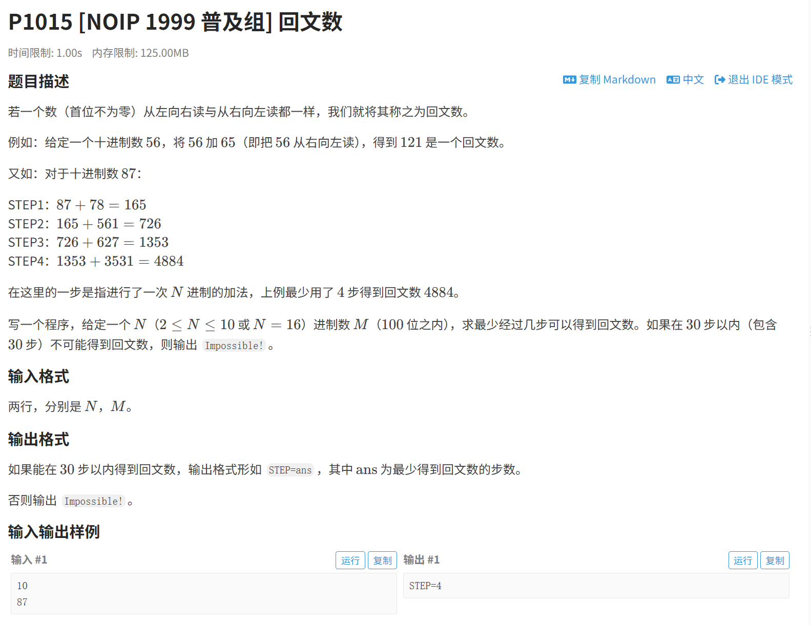
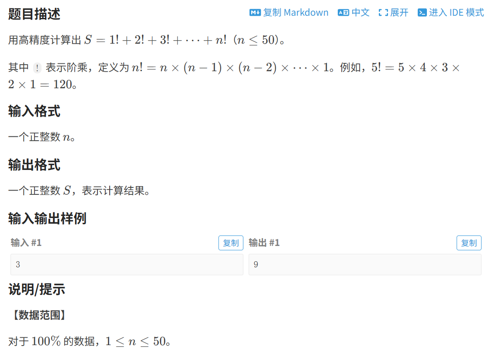

## 高精度

### 1.高精度累乘(数组实现)

```c++
#include <iostream>
#include <cstdio>

using namespace std;

typedef long long LL;

const int maxn = 100010;

int num[maxn], len;

/*
    在mult函数中，形参部分：len每次调用函数都会发生改变，n表示每次要乘以的数，最终返回的是结果的长度
    tip: 阶乘都是先求之前的(n-1)!来求n!
    初始化Init函数很重要，不要落下
*/

void Init() {
    len = 1;
    num[0] = 1;
}

int mult(int num[], int len, int n) {
    LL tmp = 0;
    for(LL i = 0; i < len; ++i) {
         tmp = tmp + num[i] * n;    //从最低位开始，等号左边的tmp表示当前位，右边的tmp表示进位（之前进的位）
         num[i] = tmp % 10; //  保存在对应的数组位置，即去掉进位后的一位数
         tmp = tmp / 10;    //  取整用于再次循环,与n和下一个位置的乘积相加
    }
    while(tmp) {    //  之后的进位处理
         num[len++] = tmp % 10;
         tmp = tmp / 10;
    }
    return len;
}

int main() {
    Init();
    int n;
    n = 1977; // 求的阶乘数
    for(int i = 2; i <= n; ++i) {
        len = mult(num, len, i);
    }
    for(int i = len - 1; i >= 0; --i)
        printf("%d",num[i]);    //  从最高位依次输出,数据比较多采用printf输出
    printf("\n");
    return 0;
}
```

> 注意最后的数字是倒过来的


### 2.回文数(洛谷P1015)

> 很有价值的一道题



思路就是**高精加(数组实现)+数组反转**

注意这里的高精度加法是任意进制的

```c++
#include <bits/stdc++.h>
#define ll long long
using namespace std;
const int maxn=100010;
int l,n,c=0;       //c用于计数
string s;
int a[300],b[300];


void init()  //将输入的字符串转化为数组
{
    for (int i = 0; i <= l-1; i++)
    {
        if (s[i]>='0'&&s[i]<='9')
        {
            a[i+1]=s[i]-'0';
        }
        else
        {
            a[i+1]=10+(s[i]-'A');
        }
    }
}

void add(int a[],int b[])  //以后高精加就用数组实现吧,字符串太jb麻烦了
{
   for (int i = 1; i <= l; i++)
   {
     a[i]+=b[i];
     a[i+1]+=a[i]/n;
     a[i]%=n;
   }
   if (a[l+1]>0)
   {
     l++;
   }
}

bool judge(int a[])
{
   int j=l;
   for (int i = 1; i <= l/2; i++)
   {
     if (a[i]!=a[j])
     {
        return false;
     }
     j--; 
   }
   return true;
}

void rev(int a[]) //反转
{
    for (int i = 1; i <= l; i++)
    {
        b[i]=a[l-i+1];
    }
}

int main()
{
    cin>>n;
    cin>>s;
    l=s.length();
    init();
    for (int i = 1; i <= 30; i++)
    {
        if (judge(a)==true)
        {
            cout<<"STEP="<<c;
            return 0;
        } 
        rev(a);
        add(a,b);
        c++;
    }
    cout<<"Impossible!";
    return 0;
}
```


### 3.阶乘之和(P1009)

> 同样是练高精度很好的一道题



**高精度加法+高精度乘法**

```c++
#include <bits/stdc++.h>
#define ll long long
using namespace std;
const int maxn=100010;
int n;
int a[30000],b[30000];

void plus1(int n) //高精乘
{
    ll jin=0;
    for (int i = 1000; i >= 0; i--)
    {
        a[i]=jin+a[i]*n;
        jin=a[i]/10;
        a[i]%=10;
    }
}

void add()
{
    ll jin=0;
    for (int i = 1000; i >= 0; i--)
    {
        b[i]=jin+a[i]+b[i];
        jin=b[i]/10;
        b[i]%=10;
    }
}

int main()
{
    cin>>n;
    int w;
    a[1000]=b[1000]=1;
    for (int i = 2; i <= n; i++)
    {
       plus1(i);
       add();
    }
    
    for (int i = 0; i <= 1000; i++)
    {
        if (b[i]!=0)
        {
          w=i;
          break;  
        }
    }
    for (int i = w; i <= 1000; i++)
    {
        cout<<b[i];
    }
    return 0;
}
```

> 用了一下类似于剪枝操作，每次处理都基于上一次的操作，大大缩短了用时(题解所说)

### 4.超级标准的高精度加法

> 输入两个数,输出加法结果

```c++
#include <bits/stdc++.h>
#define ll long long
using namespace std;
const int maxn=100010;

string s1,s2;
int a[30000],b[30000],l1,l2,l;

void init()
{
  int offset = 1000; // 数组的末尾索引

    for (int i = 0; i <= l1; i++) {
        a[offset - i] = s1[s1.length()- 1 - i] - '0';
    }

    for (int i = 0; i <= l2; i++) {
        b[offset - i] = s2[s2.length() - 1 - i] - '0';
    }
}

void add()
{
    int jin=0;
    for (int i = 1000; i >= 0; i--)
    {
        a[i]=a[i]+b[i]+jin;
        jin=a[i]/10;
        a[i]%=10;
    }
}

int main()
{
    cin>>s1>>s2;
    if (s1=="0")
    {
        cout<<s2;
        return 0;
    }
    else if (s2=="0")
    {
        cout<<s1;
        return 0;
    }
    
    int w;
    l1=s1.length()-1;
    l2=s2.length()-1;
    init();
   
    add();
    for (int i = 0; i <= 1000; i++)
    {
        if (a[i]!=0)
        {
            w=i;
            break;
        }
    }
    
    for (int i = w; i <= 1000; i++)
    {
        cout<<a[i];
    }
    return 0;
}
```


### 5.超级标准的高精度乘法

> 感谢gemini神力, STL yyds

如下代码实现:

```C++
#include <bits/stdc++.h>
#define ll long long
using namespace std;

typedef vector<int> bignum;

bignum init(string a)
{
    int le=a.length();
    bignum result;
    for(int i=0;i<le;i++)
    result.push_back(a[i]-'0');

    reverse(result.begin(),result.end());
    return result;
}
bignum h_mul(const bignum &a,const bignum &b)
{
    int sa=a.size();
    int sb=b.size();
    
    bignum re(sa+sb+1,0);
    for(int i=0;i<sa;i++)
    {
        for(int j=0;j<sb;j++)
        {
            re[i+j]+=a[i]*b[j];
        }
    }
    int jin=0;
    for(int i=0;i<sa+sb;i++)
    {
        ll cur=re[i]+jin;
        re[i]=cur%10;
        jin=cur/10;
    }

    while (re.size()>1&&re.back()==0)
    re.pop_back();
    
    reverse(re.begin(),re.end());
    return re;
}
int main()
{
    string a,b;
    cin>>a>>b;
    bignum ba=init(a);
    bignum bb=init(b);

    bignum ans=h_mul(ba,bb);
    for(int i=0;i<(int)ans.size();i++)
    cout<<ans[i];

    return 0;
}
```


