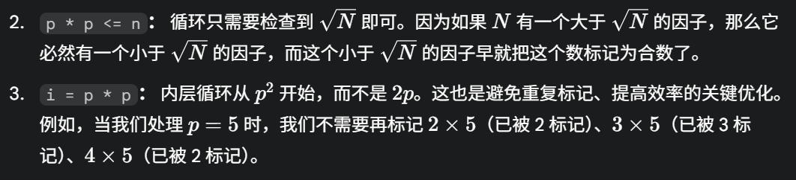

## 数学

### 1.素数埃氏筛法

如下代码实现:

```c++
void solve(int n)
{
    b[0]=b[1]=true;
    for (int i = 2; i*i <= n; i++)
    {
        if(!b[i])
        {
            for(int j=i*i;j<=n;j+=i)//注意是j+=i
            {
                b[j]=true;
            }
        }
    }
}
```

> 这里是假设所有数都是素数(false),先把0 1排除,然后再遍历,如果这个数是素数,他的倍数就不是素数
>
> 从i*i开始遍历,每次加i保证是i的倍数
>
> 如下是关键点:
>
> 


### 2.最大公约数与最小公倍数(GCD&LCM)

1. 最大公约数采用**欧几里得算法**,最小公倍数是两数乘积除于最大公约数.

​       也就是说: **两数乘积等于最大公约数乘以最小公倍数**

```c++
//运用了gcd(a,b)=gcd(b,r)的性质,r=a%b
int gcd(int a,int b)
{
    while (b)//辗转相除法
    {
        int temp=a%b;  
        a=b;
        b=temp;
    }
    return a;
}
int lcd(int a,int b,int gcd)
{
    int awa=(a/gcd)*b;//可避免溢出
    return awa;
}
```


### 3.拓展欧几里得算法

用于求 **ax+by=gcd(a,b)** 的解

```c++
ll solve4_1(ll a,ll b,ll *x,ll *y)//注意这里采用指针形式以倒序传递x,y
{
    if (b==0)
    {
        *x=1;
        *y=0;
        return a;
    }
    ll x1,y1;
    ll gcd=solve4_1(b,a%b,&x1,&y1);
    *x=y1;
    *y=x1-(a/b)*y1;

    return gcd;
}
int solve4_2()
{
    long long a,b;
    ll x,y;
    scanf("%lld %lld",&a,&b);
    solve4_1(a,b,&x,&y);//可加入判断逻辑

    ll awa=(x%b+b)%b;//为了使x大于零并且小于b
    printf("%lld\n",awa);
    return 0;
}
```

> 想完全理解还是有点难度


### 4.快速幂

##### 原理:

当求 $a^b$ 时, 我们可以通过 $a$ 自乘自己变成 $a^2$ ,再自乘变成 $a^4$ 

依次类推, 可以表示到 $a^{2^n}$ 

1. 假如要求 $a^{11}$ ，我们可以知道11的二进制是 $(1011)$ 

2. $a^{11} = a^8a^2a^1$  

3. 仔细观察就可以发现, 数字8 2 1对应就是二进制对应位数的对应十进制


**过程:**

- 制作一个 $base$。现在 $base=a$，表示的是，$a^1=a$。待会 $base$ 会变的。

- 制作一个 $ans$，初值 1，准备用来做答案。

- $base$  在每次循环后自乘, 表示 $a^{2n}$ 
- 如果此时b对应的二进制末位为1, 则执行 $ans*=base$


**代码实现:**

```c++
int qpow(int a,int b)
{
    int ans=1,base=a;
    while(b>0)
    {
        if(b&1)
        ans*=base;
        
        base*=base;
        b>>=1;
	}
    return ans;
}
```


##### SP: 关于求余运算

> 求余运算有以下性质:
>
> $$(A+B) \bmod b = (A \bmod b + B \bmod b) \bmod b$$
>
> $$(A \times B) \bmod b = ((A \bmod b) \times (B \bmod b)) \bmod b$$

如果想要快速求出 $a^b$ $mod$  $m$

可在快速幂运算中添加步骤 (基于上述性质二)

```c++
ll qpow(ll a,ll b,ll m)
{
    ll ans=1,base=a;
    while (b>0)
    {
        if(b&1)
        {
            ans*=base;
            ans%=m;
        }
        base*=base;
        base%=m;
        b>>=1;
    }
    return ans;
}
```

这样ans返回的就直接是对应的运算结果, 避免了数字的溢出

